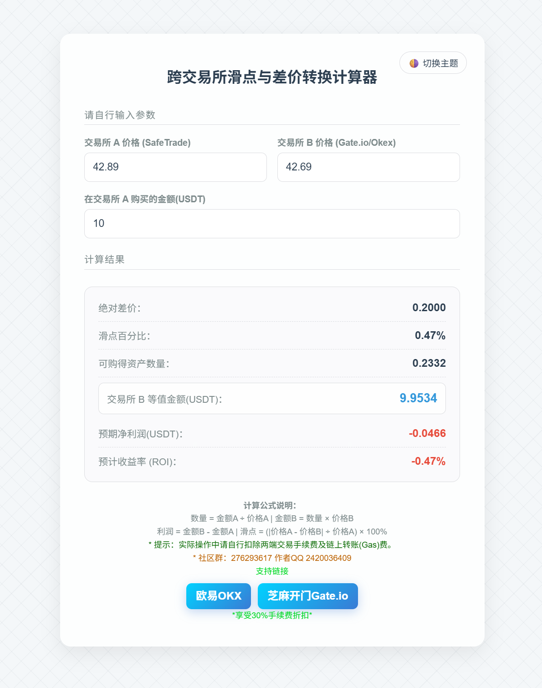
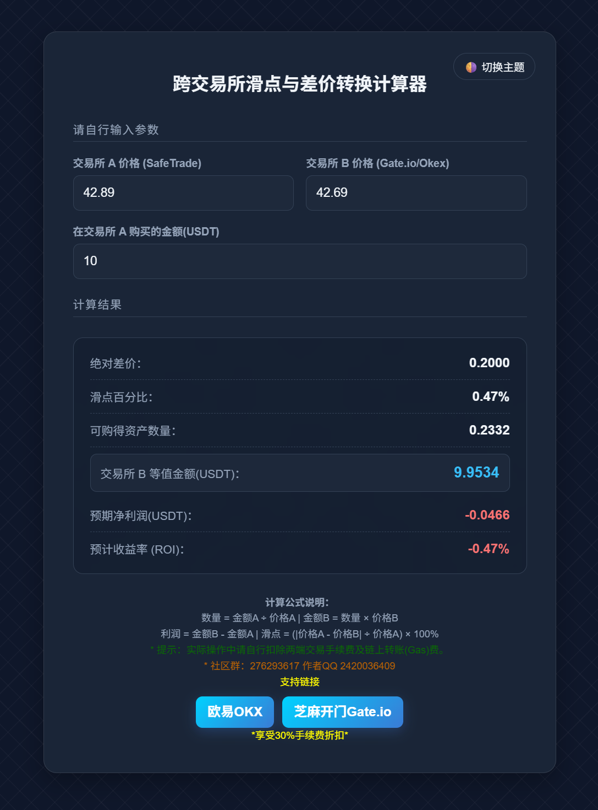

# 📊 跨交易所滑点与差价转换计算器 (Arbitrage & Slippage Calculator)

一个极简、无服务器依赖、完全运行在本地的数字资产跨交易所搬砖套利与滑点计算工具。支持实时盲算、深色/浅色主题智能切换，并伴有现代化的科技线条与毛玻璃视觉特效。

在线使用：http://www.zprl.cc.cd/ 
浏览器扩展正在开发中...

---

## ✨ 功能特性

* **⚡ 实时零延迟计算**：采用原生 JavaScript `input` 事件监听，无需点击任何“计算”按钮，键盘键入的同时即刻输出 6 项核心指标。
* **🌓 双色主题智能切换**：支持深色（Dark）与浅色（Light）模式一键平滑过渡，自动识别并适配系统主题，且具备本地存储（LocalStorage）记忆功能。
* **🎨 现代感视觉设计**：纯 CSS 渲染的斜向交叉几何线条背景，搭配高级的毛玻璃（Glassmorphism）面板，完美兼容 PC 端与移动端浏览器。
* **🛡️ 100% 隐私安全**：纯前端静态单文件，所有计算均在您的本地浏览器内完成，绝不向外发起任何网络请求，确保您的交易本金和策略数据安全。

---

## 🧮 核心计算逻辑

工具内嵌以下高精度交易算法（默认保留 4 位小数）：

* **绝对差价** = $| 交易所 A 价格 - 交易所 B 价格 |$
* **滑点百分比** = $(\text{绝对差价} \div 交易所 A 价格) \times 100\%$
* **可购资产数量** = $\text{交易所 A 购买金额} \div 交易所 A 价格$
* **交易所 B 等值金额** = $\text{可购资产数量} \times 交易所 B 价格$
* **预期净利润** = $\text{交易所 B 等值金额} - 交易所 A 购买金额$ (界面自动根据正负利润切换红/绿高亮)

---

## 🚀 快速开始与部署

### 方式一：本地直接运行 (最快)
1. 下载或复制代码库中的 `index.html`（或您的自定义文件名）。
2. 在电脑上双击该 HTML 文件，即可用任意现代浏览器（Chrome, Edge, Safari 等）直接打开并使用。

### 方式二：通过 GitHub Pages 免费在线发布
如果您想生成一个随时随地都能访问的在线链接，可以利用 GitHub 的免费静态托管服务：
1. 进入您的 GitHub 仓库，点击 **Settings** (设置)。
2. 在左侧菜单栏找到并点击 **Pages**。
3. 在 **Build and deployment** 下方的 Build source 选择 `Deploy from a branch`。
4. 将 Branch (分支) 设为 `main`（或 `master`），目录选择 `/ (root)`，点击 **Save**。
5. 等待 1-2 分钟，GitHub 就会为您生成一个专属的 `https://<您的用户名>.github.io/<仓库名>/` 在线访问网址。

---

## 🎁 推荐交易所与交易福利

在进行跨交易所套利（搬砖）时，两端的**交易手续费**会直接影响最终的净利润。建议注册使用低费率、高流动性的平台来最大化您的套利收益：

<a href="https://www.gatewebsite.net/zh/referral/registry?ref=AVBAAVFZ&ref_type=103&page=superRebate" target="_blank" style="display: inline-block; padding: 12px 30px; background: linear-gradient(135deg, #00d2ff 0%, #3a7bd5 100%); color: #ffffff; text-decoration: none; font-weight: bold; font-size: 16px; border-radius: 8px; box-shadow: 0 4px 15px rgba(58, 123, 213, 0.3); margin: 10px 0;">
    🔥 点击注册：芝麻开门 (Gate.io) 专属最高返佣通道
</a>

> **📌 提示**：通过上方专属通道注册，可享受平台最高级别的交易手续费减免与新币申购福利，有效降低套利成本。

---

## ⚠️ 免责声明 (Disclaimer)

* 本工具仅作为交易数据模拟与数学公式计算辅助之用，不构成任何投资建议或跟单指引。
* 实际搬砖套利中，请务必额外肉眼扣除**交易所充提币手续费（Gas 费）**、**币种挂单/吃单手续费**以及潜在的**网络延时网络拥堵导致的滑点扩大**风险。市场有风险，投资需谨慎。